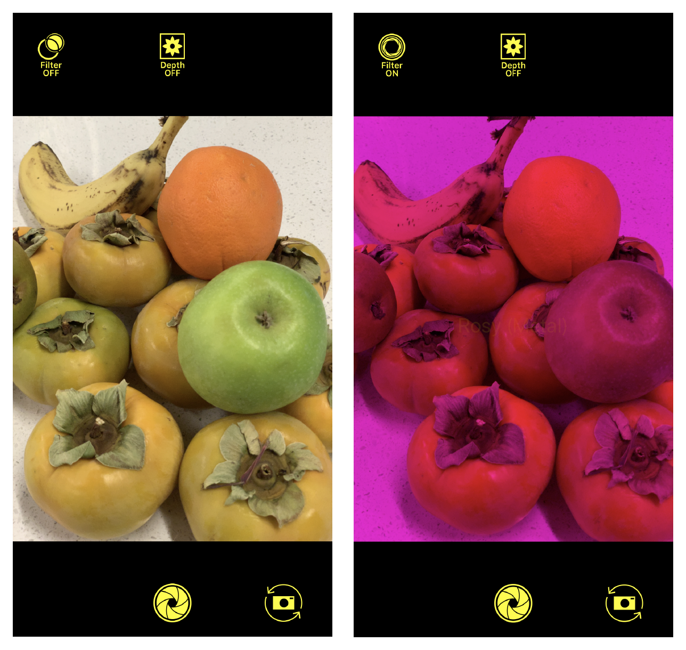

# AVCamFilter: Applying Filters to a Capture Stream

Render a capture stream with rose-colored filtering and depth effects.

## Overview

AVCamFilter is a sample camera app that takes photos with filtered effects. It shows the user a live preview of the scene with the effect rendered on top.



This sample shows you how to apply a filter with a rose-colored lens using Core Image and Metal. It also shows how to render depth and a smoothened depth effect on top of the capture stream using a grayscale filter. Finally, AVCamFilter allows the user to modulate the frame rate and the effect through sliders.

## Getting Started

Build and run AVCamFilter on a device running iOS 12 or later. This sample won't work in Simulator. Also, because Metal won’t compile on Simulator, set the build target and schema to a device, or “Generic iOS Device,” before building. The depth effect also won't show on devices that don't support depth capture, such as the iPhone 6S and before.

## Show the Camera Preview in a Metal View

AVCamFilter uses `PreviewMetalView`, a custom subclass of [`MTKView`](https://developer.apple.com/documentation/metalkit/mtkview), instead of a [`UIView`](https://developer.apple.com/documentation/uikit/uiview) as its preview view, because the standard [`AVCaptureVideoPreviewLayer`](https://developer.apple.com/documentation/avfoundation/avcapturevideopreviewlayer) gets its frames directly from the [`AVCaptureSession`](https://developer.apple.com/documentation/avfoundation/avcapturesession), with no opportunity for the app to apply effects to those frames. By subclassing `MTKView`, AVCamFilter can apply the rose-colored filter and depth grayscale filter before rendering each frame.

The `PreviewMetalView` defines its rendering behavior in `draw`. It creates a Metal texture from the image buffer, so it can transform and render that texture to the image:

``` swift
let width = CVPixelBufferGetWidth(previewPixelBuffer)
let height = CVPixelBufferGetHeight(previewPixelBuffer)

if textureCache == nil {
    createTextureCache()
}
var cvTextureOut: CVMetalTexture?
CVMetalTextureCacheCreateTextureFromImage(kCFAllocatorDefault,
                                          textureCache!,
                                          previewPixelBuffer,
                                          nil,
                                          .bgra8Unorm,
                                          width,
                                          height,
                                          0,
                                          &cvTextureOut)
```
[View in Source](x-source-tag://DrawMetalTexture)

## Create a Filter Renderer

The custom `FilterRenderer` class serves as the parent for all rendering classes, such as the rose-colored filter and the grayscale converter. `RosyMetalRenderer` and `DepthToGrayscaleConverter` are both subclasses of `FilterRenderer` which provide specific filtering functionality.

`FilterRenderer` encapsulates all the resources and functions necessary to render an effect to the image. For example, it allocates a pool of output buffers for rendering:

``` swift
var pixelBuffers = [CVPixelBuffer]()
var error: CVReturn = kCVReturnSuccess
let auxAttributes = [kCVPixelBufferPoolAllocationThresholdKey as String: allocationThreshold] as NSDictionary
var pixelBuffer: CVPixelBuffer?
while error == kCVReturnSuccess {
    error = CVPixelBufferPoolCreatePixelBufferWithAuxAttributes(kCFAllocatorDefault, pool, auxAttributes, &pixelBuffer)
    if let pixelBuffer = pixelBuffer {
        pixelBuffers.append(pixelBuffer)
    }
    pixelBuffer = nil
}
pixelBuffers.removeAll()
```
[View in Source](x-source-tag://AllocateRenderBuffers)

`FilterRenderer` also maintains a retained buffer count to tell renderers how many buffers it can hold at one time. This hint prepares the renderer to size and preallocate its pool before beginning to render the scene:

``` swift
func prepare(with inputFormatDescription: CMFormatDescription, outputRetainedBufferCountHint: Int)

// Release resources.
func reset()

// The format description of the output pixel buffers.
var outputFormatDescription: CMFormatDescription? { get }

// The format description of the input pixel buffers.
var inputFormatDescription: CMFormatDescription? { get }

// Render the pixel buffer.
func render(pixelBuffer: CVPixelBuffer) -> CVPixelBuffer?
```

## Apply a Rose-Colored Filter

AVCamFilter applies a rose-colored filter on top of the camera stream in two ways:

* `RosyCIRenderer` applies a Core Image `CIColorMatrix` filter to the input buffer.

* `RosyMetalRenderer` creates a Metal texture from the image buffer and applies the shader in `RosyEffect.metal`.

Both approaches run on the GPU for optimal performance. Because the Core Image approach doesn't require GPU command queues, `RosyCIRenderer` involves less direct manipulation of the GPU than its Metal counterpart and chains more seamlessly with other Core Image filters. Unlike the Metal function, `RosyCIRenderer` requires the creation and application of a [`CIFilter`](https://developer.apple.com/documentation/coreimage/cifilter):

``` swift
ciContext = CIContext()
rosyFilter = CIFilter(name: "CIColorMatrix")
rosyFilter!.setValue(CIVector(x: 0, y: 0, z: 0, w: 0), forKey: "inputGVector")
```
[View in Source](x-source-tag://FilterCoreImageRosy)

For more information about `CIColorMatrix`, see the [Core Image Filter Reference](https://developer.apple.com/library/archive/documentation/GraphicsImaging/Reference/CoreImageFilterReference/index.html#//apple_ref/doc/filter/ci/CIColorMatrix).

In the Metal approach, AVCamFilter sets up a command queue and thread groups to do the rendering:

``` swift
guard let inputTexture = makeTextureFromCVPixelBuffer(pixelBuffer: pixelBuffer, textureFormat: .bgra8Unorm),
    let outputTexture = makeTextureFromCVPixelBuffer(pixelBuffer: outputPixelBuffer, textureFormat: .bgra8Unorm) else {
        return nil
}

// Set up command queue, buffer, and encoder.
guard let commandQueue = commandQueue,
    let commandBuffer = commandQueue.makeCommandBuffer(),
    let commandEncoder = commandBuffer.makeComputeCommandEncoder() else {
        print("Failed to create a Metal command queue.")
        CVMetalTextureCacheFlush(textureCache!, 0)
        return nil
}

commandEncoder.label = "Rosy Metal"
commandEncoder.setComputePipelineState(computePipelineState!)
commandEncoder.setTexture(inputTexture, index: 0)
commandEncoder.setTexture(outputTexture, index: 1)

// Set up the thread groups.
let width = computePipelineState!.threadExecutionWidth
let height = computePipelineState!.maxTotalThreadsPerThreadgroup / width
let threadsPerThreadgroup = MTLSizeMake(width, height, 1)
let threadgroupsPerGrid = MTLSize(width: (inputTexture.width + width - 1) / width,
                                  height: (inputTexture.height + height - 1) / height,
                                  depth: 1)
commandEncoder.dispatchThreadgroups(threadgroupsPerGrid, threadsPerThreadgroup: threadsPerThreadgroup)

commandEncoder.endEncoding()
commandBuffer.commit()
```
[View in Source](x-source-tag://FilterMetalRosy)

The function, `RosyEffect.metal`, sets the output color of a pixel to its input color, so most of the image content remains the same, resulting in a transparent effect. However, the kernel excludes the green component, giving the image a rose-colored appearance:

```
kernel void rosyEffect(texture2d<half, access::read>  inputTexture  [[ texture(0) ]],
					   texture2d<half, access::write> outputTexture [[ texture(1) ]],
					   uint2 gid [[thread_position_in_grid]])
{
    // Don't read or write outside of the texture.
    if ((gid.x >= inputTexture.get_width()) || (gid.y >= inputTexture.get_height())) {
        return;
    }

    half4 inputColor = inputTexture.read(gid);

    // Set the output color to the input color, excluding the green component.
    half4 outputColor = half4(inputColor.r, 0.0, inputColor.b, 1.0);

    outputTexture.write(outputColor, gid);
}
```

For more information about setting up a Metal compute command encoder, see [MTLComputeCommandEncoder](https://developer.apple.com/documentation/metal/mtlcomputecommandencoder).

## Vary the Mix Factor

When the user tweaks the “MixFactor” slider, AVCamFilter modulates the intensity of the filter’s mixture:

``` swift
dataOutputQueue.async {
    self.videoDepthMixer.mixFactor = mixFactor
}
processingQueue.async {
    self.photoDepthMixer.mixFactor = mixFactor
}
```
[View in Source](x-source-tag://VaryMixFactor)

The sample accomplishes this in code by setting the mix parameter in `VideoMixer.swift`. This helper class marshals mixing commands in a command queue, buffer, and encoder. When the mix factor changes, the rendering pipeline pulls in those changes by varying the bytes in a rendered fragment:

``` swift
var parameters = MixerParameters(mixFactor: mixFactor)

commandEncoder.label = "Video Mixer"
commandEncoder.setRenderPipelineState(renderPipelineState!)
commandEncoder.setVertexBuffer(fullRangeVertexBuffer, offset: 0, index: 0)
commandEncoder.setFragmentTexture(inputTexture0, index: 0)
commandEncoder.setFragmentTexture(inputTexture1, index: 1)
commandEncoder.setFragmentSamplerState(sampler, index: 0)
commandEncoder.setFragmentBytes(UnsafeMutableRawPointer(&parameters), length: MemoryLayout<MixerParameters>.size, index: 0)
commandEncoder.drawPrimitives(type: .triangleStrip, vertexStart: 0, vertexCount: 4)
commandEncoder.endEncoding()
```
[View in Source](x-source-tag://PerformMix)

The Metal function, `Mixer.metal`, specifies the mixing operation for each fragment:

```
fragment half4 fragmentMixer( VertexIO        inputFragment    [[ stage_in ]],
                              texture2d<half> mixerInput0      [[ texture(0) ]],
                              texture2d<half> mixerInput1      [[ texture(1) ]],
                              const device    mixerParameters& mixerParameters [[ buffer(0) ]],
                              sampler         samplr           [[ sampler(0) ]])
{
    half4 input0 = mixerInput0.sample(samplr, inputFragment.textureCoord);
    half4 input1 = mixerInput1.sample(samplr, inputFragment.textureCoord);

    half4 output = mix(input0, input1, half(mixerParameters.mixFactor));

    return output;
}
```

## Stream Depth Data

AVCamFilter streams depth data in addition to RGB video by maintaining buffers dedicated to depth information. The `CameraViewController` refreshes these buffers by adhering to the [`AVCaptureDepthDataOutputDelegate`](https://developer.apple.com/documentation/avfoundation/avcapturedepthdataoutputdelegate) protocol and implementing the delegate method [`depthDataOutput(_:didOutput:timestamp:connection:)`](https://developer.apple.com/documentation/avfoundation/avcapturedepthdataoutputdelegate/2873866-depthdataoutput):

``` swift
var depthFormatDescription: CMFormatDescription?
CMVideoFormatDescriptionCreateForImageBuffer(allocator: kCFAllocatorDefault,
                                             imageBuffer: depthData.depthDataMap,
                                             formatDescriptionOut: &depthFormatDescription)
if let unwrappedDepthFormatDescription = depthFormatDescription {
    videoDepthConverter.prepare(with: unwrappedDepthFormatDescription, outputRetainedBufferCountHint: 2)
}
```
[View in Source](x-source-tag://StreamDepthData)

`outputRetainedBufferCountHint` is the number of pixel buffers the renderer retains as it draws the scene. AVCamFilter’s depth converter preallocates its buffers with an `outputRetainedBufferCountHint` of 2 frames of latency to cover the `dispatch_async` call.

The `DepthToGrayscaleConverter` class converts depth values to grayscale pixels in the preview. Like the rose-colored filter, `DepthToGrayscaleConverter` relies on a Metal function, `DepthToGrayscale.metal`, to perform texture transformations:

```
kernel void depthToGrayscale(texture2d<float, access::read> inputTexture   [[ texture(0) ]],
						                 texture2d<float, access::write> outputTexture [[ texture(1) ]],
                             constant converterParameters& converterParameters [[ buffer(0) ]],
                             uint2 gid [[ thread_position_in_grid ]])
{
    // Don't read or write outside of the texture.
    if ((gid.x >= inputTexture.get_width()) || (gid.y >= inputTexture.get_height())) {
        return;
    }

    float depth = inputTexture.read(gid).x;

    // Normalize the value between 0 and 1.
    depth = (depth - converterParameters.offset) / (converterParameters.range);

    float4 outputColor = float4(float3(depth), 1.0);

    outputTexture.write(outputColor, gid);
}
```

## Smooth Depth Data

Without smoothing, the depth data in each frame may have gaps or holes. Smoothing the depth data reduces the effect of frame-to-frame discrepancies by interpolating previous and subsequent frames to fill in the holes. To achieve this smoothing in code, set a parameter on [`AVCaptureDepthDataOutput`](https://developer.apple.com/documentation/avfoundation/avcapturedepthdataoutput):

``` swift
sessionQueue.async {
    self.depthDataOutput.isFilteringEnabled = smoothingEnabled
}
```
[View in Source](x-source-tag://SmoothDepthData)

## Modulate Frame Rate

AVCamFilter also shows how to change the frame rate at which the camera delivers depth data. When the user moves the “FPS” (frames per second) slider, the app converts this user-facing representation of frame rate to its inverse, frame duration, for setting the video device's  [`activeDepthDataMinFrameDuration`](https://developer.apple.com/documentation/avfoundation/avcapturedevice/2968215-activedepthdataminframeduration) accordingly:

``` swift
try self.videoInput.device.lockForConfiguration()
self.videoInput.device.activeDepthDataMinFrameDuration = duration
self.videoInput.device.unlockForConfiguration()
```
[View in Source](x-source-tag://VaryFrameRate)

Changing the frame rate allows the user to control how fast the app refreshes the live stream. For example, a user who cares less about the granularity of depth information may lower the frame rate of depth data while maintaining a high RGB frame rate.
